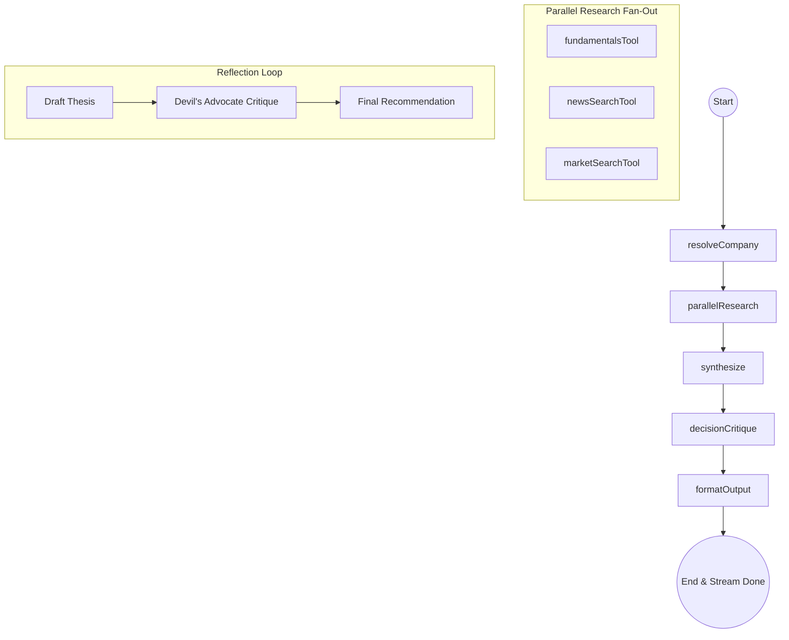

# Aether: Multi-Agent Autonomous Investment Research Core

Aether is a next-generation, multi-agent AI investment research assistant built on **LangGraph.js**, **Express**, and **React (Vite)**. It automates equity research workflows by fetching financial fundamentals, crawling recent news archives, analyzing market landscapes, and running a skeptically-audited reflection loop before presenting structured investment recommendations.

---

## 🚀 Overview

Aether turns a simple, possibly informal company query (e.g., "Apple" or "Reliance") into an in-depth investment dossier. The platform's mission is to tackle confirmation bias and shallow web-search summaries by using:
* **Canonical Entity Resolution**: Cleans ambiguous names and maps them to verified tickers.
* **Concurrent Scraping**: Runs parallel scraping for fundamentals, market positioning, and recent sentiment news.
* **Critique Reflection (Devil's Advocate)**: Challenges its own initial draft thesis through a separate "critique" pass to avoid overconfidence.
* **SSE Stream Processing**: Delivers real-time stage updates to the frontend via Server-Sent Events (SSE).

---

## 💻 How to Run It

### 🔑 Prerequisites & Environment Keys
You will need API keys for the following services:
1. **Google Gemini / OpenRouter API Key**: Set as `GOOGLE_API_KEY`. (If the key begins with `sk-` or `sk-or-`, the backend automatically routes it to **OpenRouter**, otherwise it runs natively via **Google Gen AI**).
2. **Tavily API Key**: Set as `TAVILY_API_KEY`. (Used for real-time web crawler search queries).
3. **Alpha Vantage API Key**: Set as `ALPHA_VANTAGE_API_KEY`. (Used for corporate financial metrics and stock quotes).

### 🛠️ Step-by-Step Setup

Clone the repository and follow the setup instructions for the backend and frontend:

#### 1. Backend Setup
1. Open your terminal and navigate to the `backend` directory:
   ```bash
   cd backend
   ```
2. Create your `.env` configuration file:
   ```bash
   cp .env.example .env
   ```
   Edit `.env` and fill in your keys:
   ```env
   GOOGLE_API_KEY=your_gemini_or_openrouter_api_key
   GEMINI_MODEL=openrouter/free  # e.g., google/gemini-2.5-flash:free or gemini-2.0-flash
   TAVILY_API_KEY=your_tavily_api_key
   ALPHA_VANTAGE_API_KEY=your_alpha_vantage_api_key
   PORT=5001
   CORS_ORIGIN=http://localhost:5173
   ```
3. Install dependencies:
   ```bash
   npm install
   ```
4. Start the backend development server:
   ```bash
   npm run dev
   ```
   *The backend will run on `http://localhost:5001`.*

#### 2. Frontend Setup
1. In a new terminal window, navigate to the `frontend` directory:
   ```bash
   cd frontend
   ```
2. Create your `.env` file:
   ```env
   VITE_API_URL=http://localhost:5001
   ```
3. Install dependencies:
   ```bash
   npm install
   ```
4. Start the frontend development server:
   ```bash
   npm run dev
   ```
   *The client dashboard will open on `http://localhost:5173`.*

---

## 🏗️ How it Works: Approach & Architecture

Aether models its decision process after elite buy-side research desks, organizing the pipeline into an acyclic **StateGraph** implemented with `@langchain/langgraph`.



### The 5-Stage Agent Graph

1. **`resolveCompany`**: Resolves the user's input string to a canonical company name, exchange, sector, and public ticker. 
   * *Safety Check*: If the model is not confident about the ticker, it returns `null` to prevent wrong financial data requests downstream.
2. **`parallelResearch`**: Runs three search and scraping operations in parallel using `Promise.allSettled`:
   * **Fundamentals**: Queries Alpha Vantage for P/E ratios, profit margins, PEG, EBITDA, and quotes.
   * **Recent News**: Uses Tavily news search to retrieve major product launches, earnings headlines, or controversies.
   * **Market landscape**: Gathers competitive market share reports and industry tailwinds.
3. **`synthesize`**: Combines the three raw data streams, organizes highlights into strengths, risks, and catalysts, and explicitly isolates **Data Gaps** (unresolved data fields).
4. **`decisionCritique`**: Operates as a double-pass reflection loop:
   * **Pass 1 (Draft)**: Formulates an initial recommendation (`Invest`, `Hold`, or `Pass`) and a confidence percentage.
   * **Pass 2 (Critique)**: Invokes a skeptical "devil's advocate" agent to find counter-arguments. The agent then either revises or reinforces the final recommendation.
5. **`formatOutput`**: Assembles the final state into a consolidated JSON payload, aggregates source citation URLs, and registers warnings about any failed crawler operations.

---

## ⚖️ Key Decisions & Trade-Offs

### 1. Sequential Reflection over One-Shot Generation
* **Decision**: We run a double-pass "devil's advocate" reflection loop instead of a single-pass recommendation.
* **Why**: Large Language Models tend to default to confirmation bias, agreeing too easily with the positive outlooks found in news. Forcing the model to write the strongest possible case *against* its own draft decision checks this bias and leads to more realistic confidence ratings.
* **Trade-off**: Increases request duration and token consumption. We optimized this by restricting the critique scope to the synthesized state, keeping input payloads small.

### 2. Error Degradation via `Promise.allSettled`
* **Decision**: Parallel research is executed inside a single graph node using concurrency-controlled API calls instead of branching the graph itself.
* **Why**: Branching graphs in LangGraph JS introduces synchronization overhead. By managing the fan-out programmatically via `Promise.allSettled`, we can capture partial failures (e.g., API key limit exhaustion) and let the graph degrade gracefully. If Alpha Vantage is unavailable, the pipeline records a `dataGap` and proceeds with News and Market analyses rather than failing the run.

### 3. Server-Sent Events (SSE) for Real-Time Streaming
* **Decision**: Utilizes Express SSE (`res.write`) to stream step transitions to the UI.
* **Why**: The full research graph takes 10 to 15 seconds to run. SSE allows the UI to render a live checklist showing which node is active and what data has loaded, resulting in a responsive, modern UX compared to long-running REST calls or complex polling setups.

---

## 📊 Example Runs

Below are summaries of how the agent behaves under different inputs:

### Run 1: Tesla Inc. (TSLA)
* **Status**: `Invest` (Confidence: `78%`)
* **Critique Verdict**: `Revised` (Confidence lowered from `90%` to `78%` due to valuation multiples).
* **Key Findings**: Leading EV market share and massive autonomous taxi catalysts, but offset by high P/E multiples and battery supply-chain dependency.
* **Data Quality**: 100% (All tools resolved successfully).

### Run 2: Reliance Industries
* **Status**: `Hold` (Confidence: `85%`)
* **Critique Verdict**: `Reinforced`
* **Key Findings**: Strong dominance in telecom (Jio) and retail sectors, stable cash flows from oil-to-chemicals. Current oil market headwinds warrant a "Hold" rather than an active buy.
* **Data Quality**: Partial (Alpha Vantage overview returned no ticker; news/market search acted as the primary drivers).

---

## 🔮 What We Would Improve With More Time

1. **Persistent Caching**: Transition the current in-memory `Map` cache to a distributed cache (e.g., Redis) to support multi-instance server deployments and share caching across sessions.
2. **SEC Filing Scraping**: Integrate a SEC EDGAR crawler tool to pull official quarterly/annual statements (10-K/10-Q) rather than relying exclusively on aggregate APIs.
3. **Graph Branching in LangGraph Studio**: Re-architect the parallel crawling phase as explicit graph branches to allow visual inspection and debugging inside LangGraph Studio.
4. **Custom Backtesting Sandbox**: Allow users to run mock backtests of the recommendation thesis against historical stock prices directly in the dashboard UI.

---

## 🎁 Bonus: LLM Pair Programming Transcript & Logs

This project was built in close collaboration with Gemini/Antigravity. You can review the complete chronological transcripts, internal thought processes, dependency conflict resolutions, and deployment steps in [**`llm_chat_history.md`**](file:///c:/Users/Aviral/Desktop/Project/INSIDEIIM/assignment2/investment-research-agent/llm_chat_history.md) at the root of the workspace.
